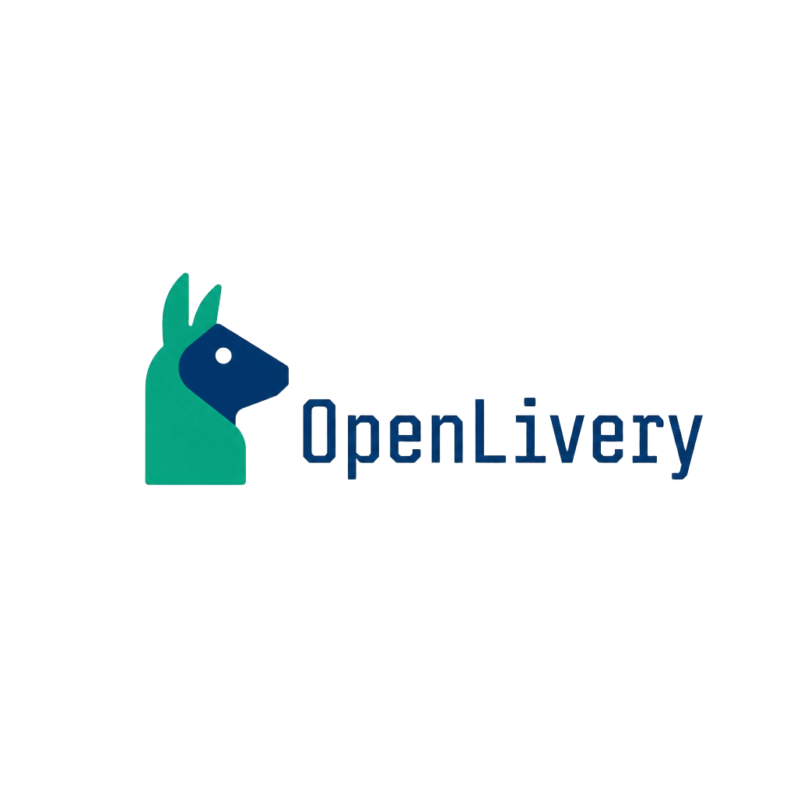

<p align="center">

  

</p>

<h1 align="center">Openvoiss</h1>

<p align="center">

  The open-source, white-label platform for agencies to build, run and manage AI agents for their clients.

</p>

<p align="center">

  <a href="https://openvoiss.com/docs"><strong>Documentation</strong></a> ·
  <a href="https://openvoiss.com/docs/getting-started">Quick start</a> ·
  <a href="https://openvoiss.com/docs/self-hosting">Self-hosting</a> ·
  <a href="https://github.com/kanazawa-dev/openvoiss/discussions">Discussions</a>

</p>

<p align="center">

  <a href="./LICENSE"></a>

  

  

  

</p>

---

Openvoiss is a multi-tenant workspace where an agency creates AI agents for its
clients, gives each client a branded portal, and talks to end users over
WhatsApp or an embeddable web chat widget. Bring your own OpenAI / Anthropic
keys and self-host the whole thing with one command.

## Documentation

Full documentation lives at [**openvoiss.com/docs**](https://openvoiss.com/docs).


| Guide                                                          | What it covers                                         |
| -------------------------------------------------------------- | ------------------------------------------------------ |
| [Getting started](https://openvoiss.com/docs/getting-started) | Run the stack with Docker and create your first agency |
| [Configuration](https://openvoiss.com/docs/configuration)     | Environment variables, secrets, ports and the gateway  |
| [Architecture](https://openvoiss.com/docs/architecture)       | The services, the data model and tenant isolation      |
| [Self-hosting](https://openvoiss.com/docs/self-hosting)       | Deploy to a server, back up, upgrade and troubleshoot  |
| [Contributing](https://openvoiss.com/docs/contributing)       | Run the project locally, tests and conventions         |


## Features

**Agents** — [docs](https://openvoiss.com/docs/agents)

- ✅ Instructions, personality, per-client &amp; per-agent context, timezone, and temperature / max-tokens / memory controls
- ✅ Multimodal capabilities: **image recognition** (vision) and **audio transcription** for incoming media
- ✅ Creation wizard with a live token counter and industry starter templates

**Knowledge base** — [docs](https://openvoiss.com/docs/knowledge-base)

- ✅ Manual context, structured **Q&amp;A pairs** and PDF upload, with embedding-based semantic retrieval (keyword fallback)
- ✅ Portable JSON embeddings — no database extension required

**AI providers** — [docs](https://openvoiss.com/docs/ai-providers)

- ✅ Bring-your-own **OpenAI** (Responses API) and **Anthropic** (Messages API) keys — agency-level, encrypted, and validated when saved
- ✅ Any OpenAI-compatible endpoint via per-connection base URL + model

**Custom tools** — [docs](https://openvoiss.com/docs/custom-tools)

- ✅ Per-agent **HTTP tools**: any REST endpoint with path/query/body parameters, encrypted auth headers and an SSRF guard
- ✅ **MCP servers** (Streamable HTTP or SSE) with test-before-save connection checks and cached tool discovery
- ✅ Tool usage recorded per reply and surfaced in the playground, including failure details

**Channels** — [WhatsApp](https://openvoiss.com/docs/whatsapp) · [Web widget](https://openvoiss.com/docs/web-widget)

- ✅ **WhatsApp Cloud API** (official Meta API) — bring your own Meta app credentials, signed webhooks, per-client number
- ✅ **WhatsApp QR** through Baileys — QR link, per-client number, encrypted persistent session
- ✅ Embeddable **web chat widget** for any website
- 🚧 Instagram DM, Facebook Messenger *(planned)*

**Operations** — [Inbox](https://openvoiss.com/docs/inbox) · [Client portal](https://openvoiss.com/docs/client-portal) · [Dashboard](https://openvoiss.com/docs/dashboard)

- ✅ Unified **Inbox** with server-side search, filter tabs, unread tracking, pagination and human takeover
- ✅ Per-client **portal** with its own login and Inbox, optionally served under the client's **own custom domain** (DNS-verified, automatic HTTPS)
- ✅ **Dashboard** with activity, top agents, token usage by model and a date-range filter
- ✅ Agency **white-label** (name, identifier, color, logo)

## Architecture

Three services plus PostgreSQL, orchestrated by Docker Compose:


| App             | Stack                                   | Role                                                 |
| --------------- | --------------------------------------- | ---------------------------------------------------- |
| `apps/api`      | FastAPI · SQLAlchemy · Alembic          | REST API, data model, AI/knowledge/provider services |
| `apps/web`      | Next.js · React · TypeScript · Tailwind | Agency dashboard, client portal, playground, widget  |
| `apps/whatsapp` | Node.js · Baileys                       | WhatsApp Web bridge (stateful sessions)              |


All data lives in PostgreSQL; provider keys and WhatsApp sessions are encrypted
at rest. Every query is scoped by `agency_id` for tenant isolation, and public
endpoints (sign-in and the web widget) are rate-limited per client IP. A Caddy
gateway serves the app and API from a single origin (`/api/*` → backend).

Read more in the [architecture guide](https://openvoiss.com/docs/architecture).

## Project structure

```text
apps/
  api/         FastAPI backend (app/, migrations/, tests/)
  web/         Next.js frontend (app/, components/, lib/, types/)
  whatsapp/    Baileys WhatsApp bridge (src/)
docs/          Self-hosting and operations guide
scripts/       Helper scripts (generate-docker-env.sh)
Makefile       Common commands (make help)
docker-compose.yml
```

